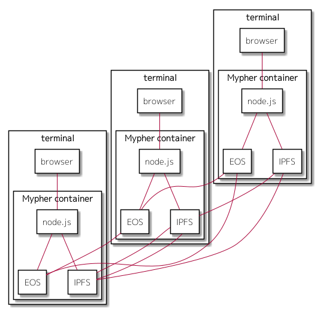
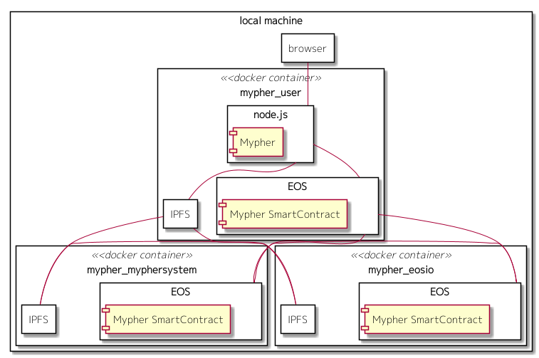
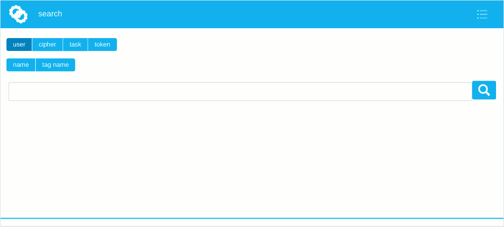

### 1) Requirements

To run Mypher, following environments are needed.

* docker
* git

If you just want to run Mypher, only the above environments are required.  
If you want to build by yourself, following environments are also required in addition to the above.  

* cmake
* EOS
* C++ compiler(like clang)

### 2) Prepare the docker image

Mypher run as docker container. Thereby you should prepare the docker image of Mypher first.   
The fixed image of Mypher is stored on Docker Hub.  
You can prepare the image by either pulling it from Docker Hub or building from the source codes.  

#### 2)-A. The case of pulling the image

If you prepare the image by pulling from Docker Hub, then all you need to do is just to execute the following command. 

```
docker pull mypher/mypher:0.01
```

#### 2)-B. The case of building from the source codes

You can build the image with following procedure.

1. download the Mypher project from GitHub
1. build the smart contracts
1. build the docker image

The details is as below.

##### 2)-B-1. Download the Mypher project from GitHub

First, you should download the Mypher project by running the following command.  

```
git clone https://github.com/mypher/mypher
```

##### 2)-B-2. Build the smart contracts

Before building the docker image, it is necessary to generate the files(abi, wasm) of the smart contracts.  
it can be done by executing the following commands.  

```shell
cd {project root directory}/smartcontract
mkdir build
cd build
cmake ..
make
```

##### 2)-B-3. Build the docker image

Then, you can build the docker image.  
Building it can be done by executing the following commands.  

```shell
cd {project root directory}/docker/image
./make.sh
```

If it successes, an images named as 'mypher/mypher' will be generated.  

#### 3) Create the docker containers

Following figure is the image about practical use of Mypher.  



The docker container of Mypher runs on each user's terminal. Each container will connect to the another containers, and then build the network.  

Currently, the smart contracts of Mypher is not deployed on EOS mainnet yet.  
There is just the test environment which runs on a local machine.  

The test environment is formed as 3 containers run on a local machine and build network. Each container has a role describes as below, and an user accesses to 1 of the containers through a web browser.



Names of the containers is as below.
* mypher_eosio
* mypher_myphersystem
* mypher_user

**mypher_eosio**  
This container runs as a peer which doesn't relate to Mypher. At first time running, this creates system account of EOS and initializes the blockchain.  

**mypher_myphersystem**  
This container opts to play a role as a peer which is owned by Mypher project on the EOS mainnet. At first time running, this creates an account which is system account of Mypher, and deploys the smart contracts.

**mypher_user**  
This container opts to play a rols as a peer which is owned by Mypher user. Just this container provides the UI of Mypher. an user accesses to this container.

To create the test environment can be done by following commands.

```shell
cd {project root directory}/docker/
./prepare_netowork.sh # create the docker network for mypher
./prepare_container.sh # create the docker containers for test environments
```

If you want to regenerate the environment, it can be done by running `prepare_container.sh` again.  

### 4) Run the test environment

To run the created test environment can be done by following commands.

```shell
cd {project root directort}/docker/
./start_all.sh
```

To stop the environment can be done by following commands.

```shell
cd {project root directory}/docker/
./stop_all.sh
```

### 5) Access to Mypher

You can access to the UI of Mypher from followninf URL.  

```
http://127.0.0.1:8800/index.html
```



In test environment, following 3 users are already prepared from the first time running.  
* testuser1111
* testuser2222
* testuser3333

You can login with above users through the below items of the menu which is placed at upper-right area. (These menu items are for development.)
* login with testuser1111
* login with testuser2222
* login with testuser3333 

