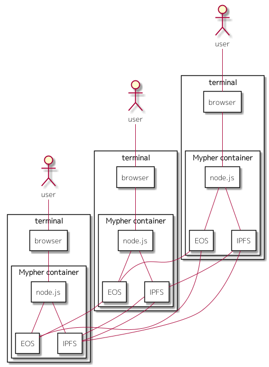

### 1) requirements

To run Mypher, following environments are needed.

* docker
* git

If you only want to run Mypher, you need to prepare is just the above things.  
If you want to build by yourself, following environments are also needed in addition to the above.  

* cmake
* EOS
* C++ compiler(like clang)

### 2) prepare the docker image

Mypher is run as docker container. Thereby you should prepare the docker image of Mypher at first.   
The fixed image of Mypher is stored on Docker Hub.  
You can prepare the image by both pulling it and building from the source codes.  

#### 2)-A. the case of pulling the image

If you prepare it by pulling from Docker Hub, then all you need to do is just executing the following command. 

```
docker pull mypher/mypher:0.01
```

#### 2)-B. the case of building from the source codes

If you build it from source codes, then you need to do the following procedure.

1. download the Mypher project from GitHub
1. build the smart contracts
1. build the docker image

The details is as below.

##### 2)-B-1. download the Mypher project from GitHub

First, you should download the Mypher project by running the following command.  

```
git clone https://github.com/mypher/mypher
```

##### 2)-B-2. build the smart contracts

Before building the docker image, it is necessary to generate the files(abi, wasm) of the smart contracts.  
it can be done by executing the following commands.  

```shell
cd {project root directory}/smartcontract
mkdir build
cd build
cmake ..
make
```

##### 2)-B-3. build the docker image

Then, you can build the docker image.  
Building it can be done by executing the following commands.  

```shell
cd {project root directory}/docker/image
./make.sh
```

If it successes, an images named as 'mypher/mypher' will be generated.  

#### 3) create the docker containers

Following figure is the image about practical use of Mypher.  




