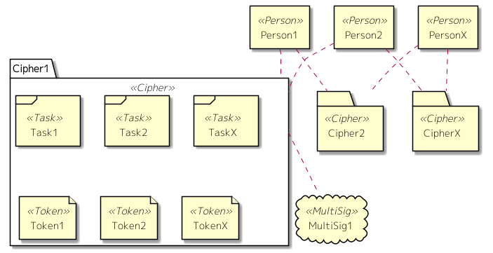

Mypher consists of 4 concepts as Person, Cipher, Task and Token.  
Cipher represents a concept of partnership.  
It can have many Tasks and Tokens as child elements.  
User and Cipher have many-to-many relationship.  

The details are as below.

#### Person

Person means the user.  

Mypher run on EOS which is one of the blockchain frameworks.
Person is same as the account of EOS. Thereby, To use Mypher, it is necessary to prepare an EOS account.  

Cryptocurrency transmission, which is mentioned later, is also done to this EOS account. 

#### Cipher

Cipher means the partnership as the unit of activity.  
Functions of this are as below.
* Decision making
* Task management
* Token management
* Cryptcurrency transmission
* Chat(not implemented yet)

To realize below functions, Cipher keeps following information.
* Purpose
* Decision making members
* Decision making rules
* Tasks
* Tokens
* Linked multisig account(mentioned later)

These information is edited by the decision making members, and formalize by approvements of them.  
The change is managed historically and everyone can confirm every version.

#### Task

(WIP)

Task means the content of the activity which Cipher will do.  
Fuctions of this is as below
* Decision about the P.I.C.
* Progress management
* Rewards payment
* Chat(not implemented yet)

To realize the below functions , Task keeps following information.  
* P.I.C.
* Reviewer
* Approvement rules for review
* Rewards information
* Results information
* Accounts who approved the P.I.C.
* Accounts who approved the results

The lifecycle of Task is as below

1. Create the Task
1. Approve it
1. Assign the P.I.C.
1. Approve it
1. Execute the Task
1. Present the results
1. Review and approve it
1. (Apply the payments)
1. (Approve it)
1. (Execute the process for getting paid)
1. Pay the rewards

P.I.C. is set by assignment of decision making members or application of an user.  
Approvement for it is done by approvements of the decision making members and an user who is set to P.I.C..  

After fixing the P.I.C., he do the Task and present the results.  
If the results is approved, then the decided rewards are paid to P.I.C.  
The rewards just can be the Token which the Cipher issued or EOS cryptocurrency.

#### Token

(WIP)

Token is the unit of values like as below.  
* License
* Certificate
* Ticket
* QR Code(not implemented yet)

This keeps following information.  
* Type
* Issuer
* Issue limit
* Number of issues
* Function
* Terms of use
* Return
* Permission to sell(not implemented yet)

"Terms of use" can be set following contents.
* Always
* By completion of specified task
* By permission of decision making members

"Function" can be set following contents.
* Distribution of specified token
* Distribution of cryptocurrency

"Return" means whether the Token is returnd or not, when it is used.

"Permission to sell" means whether the Token can be soled or not.  

The informations can be edited only until the Token is issued.
