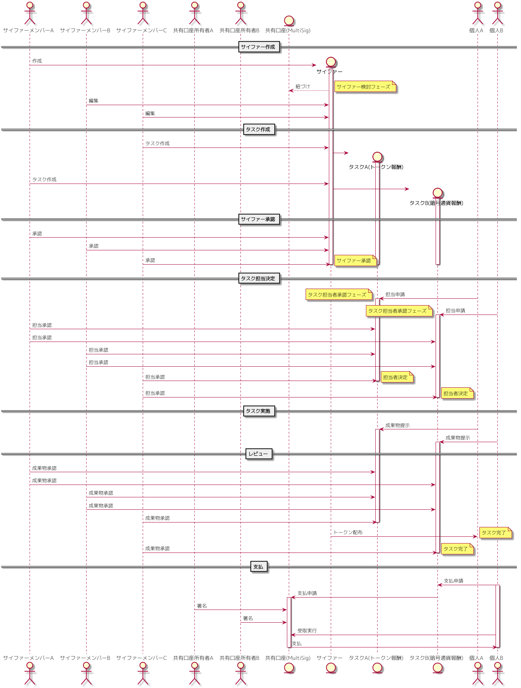

#### 運営側

##### サイファーの作成

何か実現したい目標がある個人、またはグループは、まず、その目標の実現を進めるためのサイファーを作成しますが、もし、そのサイファーが協力者に対し、報酬として暗号通貨を配布することが想定される場合、予め、サイファーのEOSアカウントを作成します。このアカウントは、後述のMultiSigアカウントという、複数人の承認を基に送金を実施するタイプのアカウントを作成します。(Mypherでは、口座のアカウント名のみを保持します。口座は作成者の所有するものです。Mypherでは、送金処理をサポートするUIを提供するのみで、サイファーからの送金はMypherを介しません。)

サイファーには、目的、編集可能メンバー、承認ルール等を設定します。この情報は、後から変更可能です。（変更を適用するには、承認ルールの要件を満たす承認が必要です。）

##### トークンの作成

そのサイファーが、タスク実施者へ配布する報酬として使用するトークンを作成します。  
上述のタイプのトークンが作成できます。  
トークンは、後から追加することも可能です。ただし、一度発行した後は、編集も削除も不可能です。

##### タスクの作成

サイファーの目標を実現するためのタスクを作成します。  
予め担当が決まっている場合は、担当者の設定も行いますが、サイファー外部の協力を求めたい場合には、未設定にして、ユーザー側からの募集を待つことも可能です。  
作成したタスクは、名称・タグ情報を基に、外部のユーザーが検索して見つけることができます。

##### 担当者承認

タスクの担当者が設定された後は、サーファーのメンバーそれぞれが、担当者を承認します。サイファーに設定された承認ルールを超える承認と、担当者自身の承認により、確定します。

##### タスク実施

担当者はタスクを実施します。実施後、サイファーに対し、成果物を提示します。

##### タスクの承認

タスクに設定されたレビュアーは、タスクをレビューし、承認します。レビュー承認ルールを満たすだけの承認が集まると。そのタスクは完了となり、報酬がトークンである場合は、即時、担当者にトークンが配布されます。報酬が暗号通貨である場合、担当者は報酬配布権利を受けます。

##### 報酬支払い（暗号通貨トークンの場合）

担当者は、サイファーに対し支払い申請をします。MultiSig口座の承認は、それを承認します。必要な承認数が集まると、担当者は、それを基に被支払い実行を行います。

#### ユーザー側

ユーザーは、現在作成されているサイファーやトークン、他のユーザーを検索して閲覧することができます。

##### 担当者申請

タスクの担当者が未設定の場合、そのタスクの担当者申請することができます。  
担当者は、サイファーの承認メンバーと、申請者の承認により、正式に承認されます。

##### タスク実施

承認されたあとは、実際にタスクを実施します。  
完了後、その成果物をタスク上に提示します。

##### レビュー承認待ち

レビュー者は、その内容をレビューし、承認します。  
承認された後、タスクに設定された報酬を受けることができます。

報酬は、その種類により受取り方が異なります。  
トークンの場合は、承認と同時に配布されます。  
暗号通貨の場合は、受取り申請を行う必要があります。

##### 支払い申請

サイファーのMultiSigアカウントに対し、支払い申請を行います。  
内部的にはEOSの"cleos multisig propose"を行っています。

##### 承認待ち

MultiSigアカウントの共有者による承認を待ちます。  
この承認は、EOSの"cleos multisig approve"に該当するもので、MypherのUI上に実行ボタンが表示されます。

##### 被支払い実行

必要数の承認が集まると、被支払い実行をすることができます。  
この実行は、EOSの"cleos multisig exec"に該当するもので、MypherのUI上に実行ボタンが表示されます。

## Cipher用暗号通貨口座（MultiSig）

Cipherで保有する暗号通貨を管理するためには、EOSのMultiSigアカウントが必要となります。  
新規に作成する形でも、既存のものを割り当てる形でも構いません。  
Cipherからの暗号通貨支払いは、全てこのアカウントから行われます。

#### 入金方法

MultiSigアカウントの入金は、普通のアカウントと同じ方法で行うことができます。  
EOSのコマンドを使用した場合、以下のコマンドとなります。

cleos transfer 送金元 MultiSigアカウント 送金額 メモ

MypherのUIとしては、送金画面は設けていません。

#### 送金方法

MtiSigアカウントは、作成時に、複数人の所有者、必要承認数を設定します。  
送金には、その設定された人数の承認が必要となります。

手順は、以下の通りとなります。

##### 送金依頼

MultiSigアカウントからの送金依頼を作成します。これは、送金先アカウントからでも、その他のアカウントからでも構いません。  
EOSでは、以下のコマンドとなります。

cleos multisig propose 依頼名 依頼内容

Mypherでは、タスク完了後、送金依頼ボタンが表情され、押下することにより、依頼が行われます。

作成した依頼は、以下のEOSコマンドで確認することができます。

cleos multisig review 依頼者 依頼名

Mypherでは、送金依頼者のアカウント情報画面から確認することができます。

##### 依頼承認

MultiSigアカウントにより、承認依頼を承認します。  
EOSコマンドでは、以下となります。

cleos multisig approve 依頼者　依頼名 承認者(JSON形式) -p 承認者のアカウント

Mypherでは、タスク画面に承認ボタンが表示され、押下することにより、承認されます。

##### 被支払い実行

必要人数の承認が集まると、支払いを受けることができます。   
受取人は、被支払い実行を行います。

EOSコマンドでは以下になります。

cleos multisig exec 依頼者 依頼名 -p 依頼人アカウント

Mypherでは、タスク画面に受取実行ボタンが表示され、押下することにより、受取りが実行されます。

