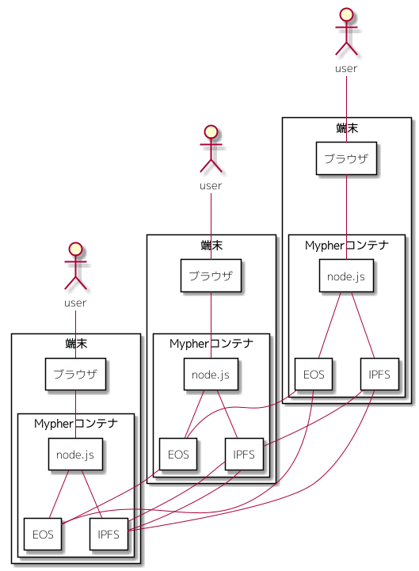

### 1) 必要環境

Mypherを実行するためには、以下の環境が必要です。

* docker
* git

Mypherのdockerイメージをdocker hubからpullする場合、上記のみ必要です。  
dockerイメージの作成から行うためには、上記に加え、以下の環境が必要です。

* cmake
* EOS
* C++コンパイラ(clang等)

### 2) dockerイメージの準備

MypherはDockerコンテナとして動作します。そのため、まず、MypherのDockerイメージを準備する必要があります。  
Docker hubには、Mypherの固定イメージがアップロードされています。  
Mypherのソースコードからdockerイメージを作成することもできますし、固定イメージをpullして使用することもできます。

#### 2)-A. docker固定イメージのpullする場合

以下のコマンドでダウンロードします。

```shell
docker pull mypher/mypher:0.01
```

イメージの準備は、これで完了です。

#### 2)-B. dockerイメージをローカルで作成する場合

dockerイメージを作成するには、

1. github上のMypherプロジェクトをダウンロード
1. スマートコントラクトのビルド
1. Dockerイメージのビルド

を行う必要があります。  
それぞれ、以下の手順で行います。

##### 2)-B-1. ソースコードのダウンロード

以下のコマンドで、任意の場所にプロジェクトをダウンロードします。

```
git clone https://github.com/mypher/mypher
```

##### 2)-B-2. スマートコントラクトのビルド

以下のコマンドで、スマートコントラクトのリソース(abi,wasm)を生成します。

```shell
cd {プロジェクトルート}/smartcontract
mkdir build
cd build
cmake ..
make
```

##### 2)-B-3. Dockerイメージのビルド

以下のコマンドで、Dockerイメージのビルドを行います。

```
cd {プロジェクトルート}/docker/image
./make.sh
```

完了すると、`mypher/mypher` という名前のdockerイメージが作成されます。

以上でdockerイメージの作成は完了です。

#### 3) dockerコンテナの作成

Mypherの実運用でのイメージは以下です。  



端末ごとにDockerコンテナを起動し、コンテナ上のEOS、IPFSがネットワークを構築する形となります。  

現状、まだEOSのメインネット上には、スマートコントラクトはデプロイしていません。  
ローカルでのテスト環境のみ準備しています。  

テスト環境は、３つのdockerコンテナ間でブロックチェインネットワークが構成され、ユーザー用コンテナに対し、ホスト端末からブラウザでアクセスする形としています。  


３つのコンテナは、それぞれ以下の名称としています。
* mypher_eosio
* mypher_myphersystem
* mypher_user

**mypher_eosio**  
このコンテナは、メインネット上のMypher以外のピアを想定したものです。  
初回起動時にEOSのシステムアカウントの生成とブロックチェインの初期設定を行います。  

**mypher_myphersystem**  
このコンテナは、メインネット上にMypherプロジェクトが所有するピアを想定したものです。  
初回起動時にMypherのシステムアカウントの準備、スマートコントラクトのデプロイを行います。  

**mypher_user**  
このコンテナは、メインネット上のMypherユーザが所有するピアを想定したものです。  
MypherのUI機能を提供します。

テスト環境の実行は、以下のコマンドで行います。
ローカルネットワークと３コンテナを作成します。

```shell
cd {プロジェクトルート}/docker/
./prepare_netowork.sh # create the docker network for mypher
./prepare_container.sh # create the docker containers for test environments
```

dockerコンテナを再作成する場合は、`perpare_container.sh` を再実行します。

### 4) テスト環境の実行

テスト環境の実行は、以下のコマンドで行います。

```shell
cd {プロジェクトルート}/docker/
./start_all.sh
```

停止は、以下のコマンドで行います。

```shell
cd {プロジェクトルート}/docker/
./stop_all.sh
```


### 5) 使用

ホスト端末のブラウザを起動し、以下のURLにアクセスすると、Mypherの画面にアクセスすることができます。

```
http://127.0.0.1:8800/index.html
```


テスト環境では、初回起動の段階で、テスト用のユーザーとして以下の３ユーザを作成します。
* testuser1111
* testuser2222
* testuser3333

右上のメニューの以下から、それぞれのユーザでログインすることができます。（開発用メニューです。）

* login with testuser1111
* login with testuser2222
* login with testuser3333

