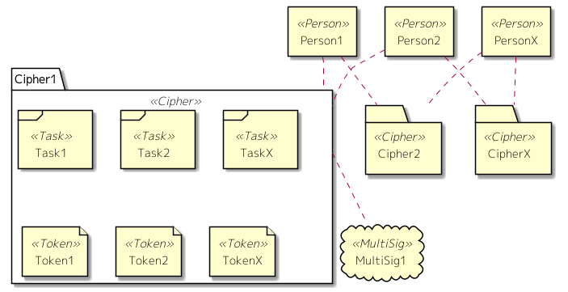

Mypherは、個人(Person)、サイファー(Cipher)、タスク(Task)、トークン(Token)という４つの概念により、成り立っています。  
サイファーは、集団を表現する概念です。  
タスク、トークンは、サイファー内の子要素となり、サイファー内で複数管理することができます。  
ユーザーとサイファーは多対多の関係となります。  

それぞれ、以下の意味を持ちます。

#### 個人

ユーザーです。  

Mypherは、ブロックチェインフームワークのひとつであるEOS上に構築されています。  
Mypherのユーザーは、EOSのアカウントとイコールです。そのため、Mypherを使用するためには、EOSのアカウントが必要となります。  

また、ログインは、EOSのアカウント名とプライベートキーにより行います。  
後述の暗号通貨送金も、ログインしたEOSアカウントに対して行われます。  

#### サイファー

活動単位となるグループを意味します。  
サイファーが持つ機能は、以下のものがあります。  
* 自身の意思決定
* タスク管理
* 独自トークンの発行・管理
* 暗号通貨報酬支払い
* チャット（未実装）

上記の機能を実現するため、サイファーは、以下の情報を保持します。
* 活動目的
* 意思決定メンバー
* 意思決定ルール
* タスク
* トークン
* MultiSigアカウント（後述）

サイファーの情報変更は意思決定メンバーにより行われ、意思決定ルールに設定された数のメンバーの承認により確定します。変更は履歴管理され、常に古い版を確認することができます。

#### タスク

個々の活動内容です。  
以下の機能を持ちます。  
* 担当者決定
* 進捗管理
* 完了時の報酬支払い
* チャット（未実装）

上記の機能を実現するために、タスクは以下の情報を保持します。  
* 担当者
* レビュアー
* レビュー承認ルール
* 報酬
* 成果物
* 担当者承認済メンバー
* 成果物承認済メンバー

タスクのライフサイクルは、以下のようになります。

1. タスク作成
1. 承認
1. 担当者設定
1. 担当者承認
1. タスク実施
1. 成果物提示
1. 成果物レビュー・承認
1. （報酬支払い申請）
1. （報酬支払い承認）
1. （報酬支払い実施）
1. 報酬支払い

担当者は、サイファーの意思決定メンバー、または、任意のユーザーの自推により設定されます。   
確定は、サイファーの意思決定メンバーの承認と設定されている担当者自身の承認により行われます。  

承認後、担当者はタスクを実施し、成果物を提示します。 
成果物が承認されると、タスクに承認された報酬が担当者に支払われます。  
報酬として設定できるものは、サイファーが発行したトークン、またはEOSトークンです。

#### トークン

トークンは、設定内容により以下のような意味を持たせることができる価値単位です。
* ライセンス
* チケット
* 証明書
* QRコード（未実装）

トークンは、以下の情報を保持します。
* 種類
* 発行者
* 発行上限
* 発行量
* 機能
* 使用開始条件
* 回収・未回収
* 個人間売買許可（未実装）

使用開始条件には、常時、特定タスクの完了、サイファー意思決定メンバーの決定、等を設定できます。  
機能には、他のトークンの配布、EOS暗号通貨の配布を設定できます。  
回収・未回収は、配布時に、トークンが回収されるか、されないかの設定です。  

全タイプのトークンに、個人間売買許可の情報を持たせることができます。証明書やライセンスのトークン等、サイファーがそのユーザーの権利として付与したものについては、個人間売買ができないように設定できます。  
単純な価値トークンである場合には、個人間売買を可能にしてトークンを流通させることにより、資産的な意味を持たせることもできます。  

それぞれの情報は、トークン未発行の間のみ編集できます。  
１度でも発行した後は、編集することができません。

